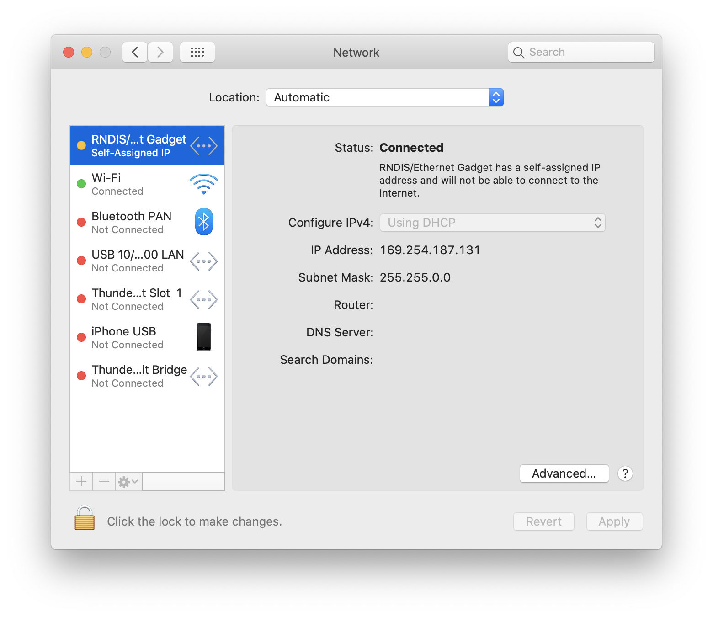
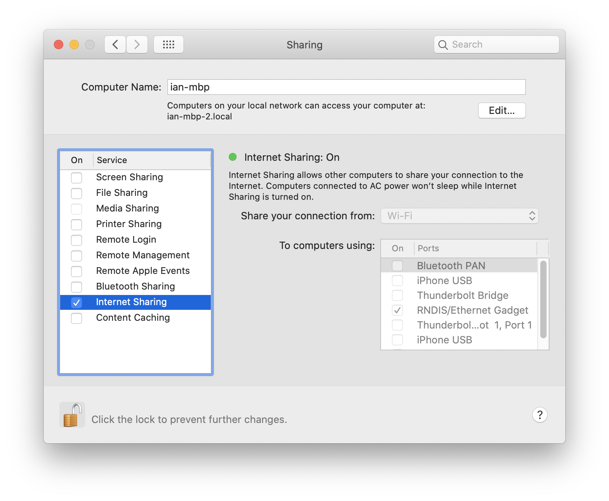

# Raspberry Pi WiFi Lamp

Welcome! This guide details how to get your lamp up and running.

## Step 1: connect the lamp to WiFi

1. ***With the lamp powered OFF,*** connect the MicroUSB port on the lamp to
your computer.

> :warning: add a picture here

2. Wait about 60 seconds to allow the lamp microcontroller to boot up. As soon
as this is complete, go to *System Preferences > Network*, and you should see
the lantern listed as "RNDIS/Ethernet Gadget", as shown in the screenshot below:

3. Go to *System Preferences > Sharing* and enable Internet sharing for the
lamp, as shown in the screenshot below:

